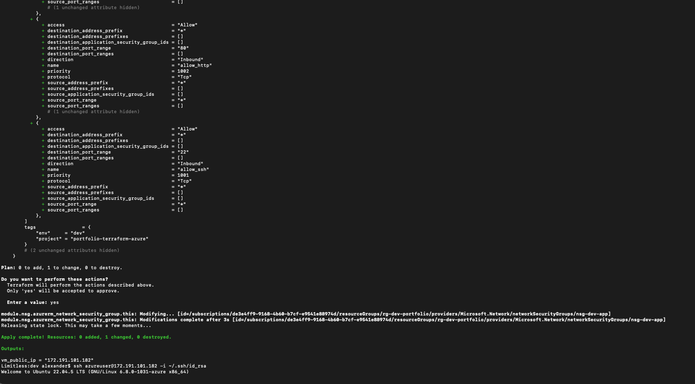
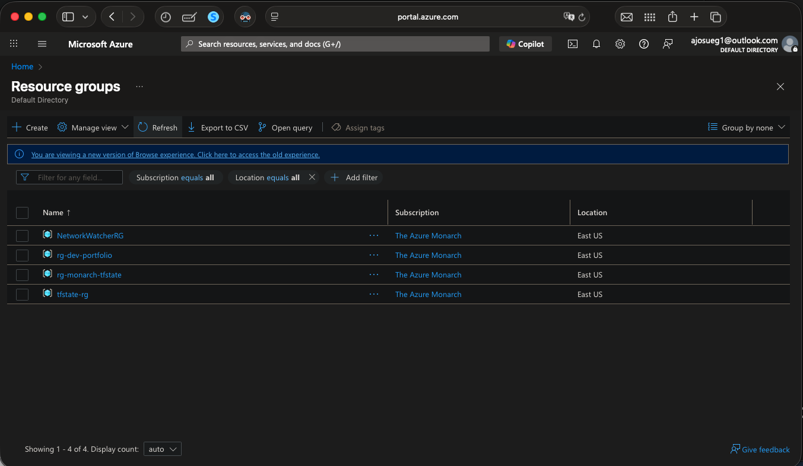
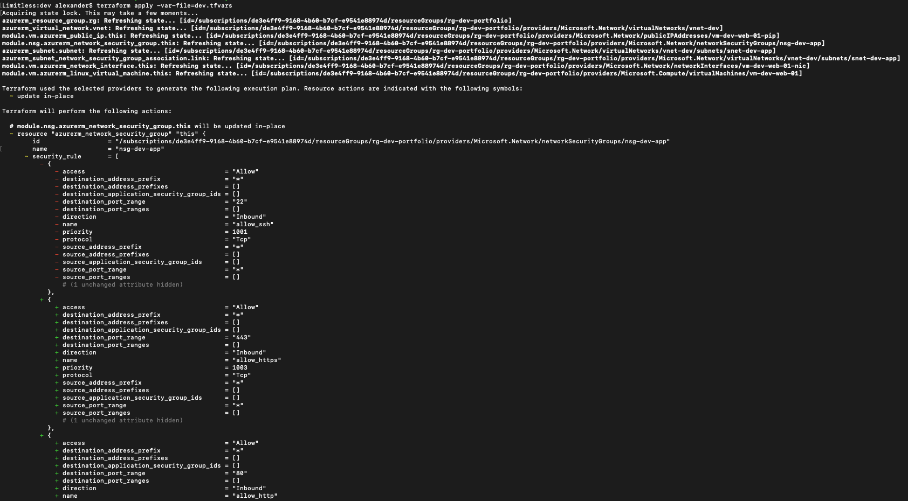
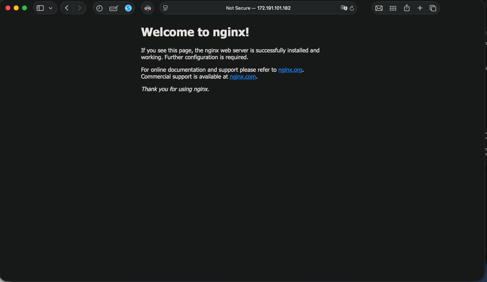
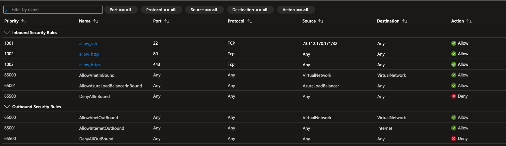

# Terraform Azure Infra Starter (Portfolio)


A clean, interview‑ready Terraform project that deploys a basic Azure landing zone:
- Resource Group, VNet, Subnet
- Network Security Group (module)
- Linux VM (module)
- Remote state stored in Azure Blob (bootstrap provided)

> Tailored for portfolio use: clear modules, dev/prod environments, CI checks, and a readable diagram.

## Architecture (high‑level)

```mermaid
flowchart LR
    subgraph Azure
      RG[Resource Group]
      VNET[VNet]
      SUBNET[Subnet]
      NSG[NSG Module]
      NIC[NIC]
      VM[Linux VM Module]
      ST[Storage Account (tfstate)]
    end

    RG --> VNET --> SUBNET
    SUBNET --> NIC --> VM
    NSG --> SUBNET
    ST -. remote state .- Terraform

    subgraph GitHub
      GH[GitHub Actions CI]
    end

    GH --> Terraform
```

## What this shows hiring managers
- **IaC fundamentals:** modules, variables, outputs, env separation
- **Azure basics:** RG, networking, VM
- **State mgmt:** remote state on Azure Blob
- **Quality:** CI for fmt/validate/plan

## Prereqs
- Terraform v1.6+
- Azure CLI (`az`) logged in to the right subscription
- An Azure Storage Account + Container for remote state (use the `modules/storage-bootstrap` to create them if you don’t have one)

## Quick start (dev)
1) Create remote state with the bootstrap (once per subscription):
```bash
cd modules/storage-bootstrap
terraform init
terraform apply -auto-approve
# Note the outputs: resource_group_name, storage_account_name, container_name
```

2) Wire backend and deploy:
```bash
cd ../../environments/dev
# update backend.tf with your values from bootstrap outputs
terraform init
terraform plan -var-file=dev.tfvars
terraform apply -var-file=dev.tfvars
```

3) Destroy when done:
```bash
terraform destroy -var-file=dev.tfvars
```

## Structure
```
.
├── .github/workflows/terraform-ci.yml
├── modules
│   ├── nsg/
│   ├── vm/
│   └── storage-bootstrap/
├── environments
│   ├── dev/
│   └── prod/
└── scripts/
```

## Notes
- The VM module defaults to Ubuntu LTS.
- SSH key path/user is configurable via `variables.tf` or `*.tfvars`.
- Keep secrets out of the repo. Use env vars or a secure secret store.
# terraform-azure-portfolio-vm

## Validation (screenshots)

<p float="left">
  
  
</p>
<p float="left">
  
  
</p>
<p float="left">
  
</p>


[](https://github.com/ajosueg89/terraform-azure-portfolio-vm/actions/workflows/terraform-ci.yml)
